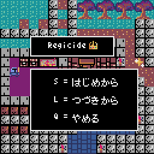
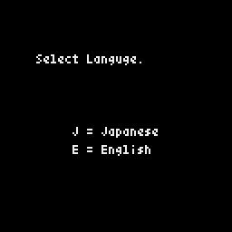
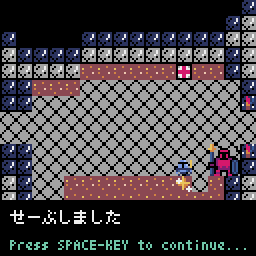
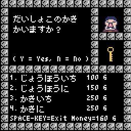
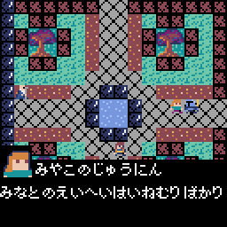

＃pyxel_knights 

pyxelのバージョンによって起動スクリプトが違います。 
pyxel Ver1.5.0 以降は [main.py] 
それより前は [main_old.py] からゲームを起動できます。 

The startup script differs depending on the version of pyxel. 
For pyxel Ver1.5.0 or later, use [main.py]. 
Before that, you can start the game from [main_old.py]. 
 

pythonのレトロゲームエンジン"pyxel"で作成したアクションRPGです。 
This is an action RPG created with the python retro game engine "pyxel". 
 
 

言語は日本語と英語で作成しています。 
The game is in Japanese and English. *However, I am not confident in my English. 
 
 

セーブ・ロード機能があり、進行状態を保存することができます。 
he game has a save/load function that allows you to save your progress. 
 
 

ショップでの買い物やNPCとの会話などのイベントを作成しています。 
I have created events such as shopping at the store and talking with NPCs. 

 
 

作者はWindows10、Windows11で開発を行っており、そのほかの環境での動作確認はしていません。 
I am developing on Windows 10 and Windows 11, and I have not tested the game on other environments. 
 

遊んでくれたらうれしいです。 
ご覧いただきありがとうございます。 
I'd be happy if you could play with it. 
Thank you for reading. 